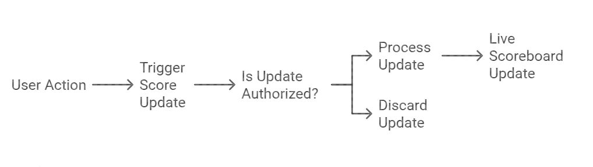

# API Service Module Specification

## Overview

This module will handle the backend logic for managing and displaying the scoreboard with real-time updates. It includes endpoints for score updates, real-time broadcasting, and robust security mechanisms to prevent unauthorized score modifications.

---

## Features

1. **Real-Time Scoreboard Updates**

   - Live update mechanism to broadcast the top 10 scores to all connected clients.

2. **Secure Score Update API**

   - Endpoint for securely updating user scores.
   - Validation and authorization checks to ensure authenticity.

3. **Score Retrieval**
   - Endpoint to fetch the top 10 user scores for initial rendering.

---

## API Endpoints

### 1. Update Score

**Endpoint:** `PUT /api/scores/update`
**Header:**

```http
PUT /api/scores/update HTTP/1.1
Host: api-host
Authorization: Bearer <token>
Content-Type: application/json
```

**Request Body:**

```json
{
  "userId": "string",
  "action": "string"
}
```

**Response:**

- **200 OK:**
  ```json
  {
    "data": {
      "userId": "string",
      "score": "string"
    },
    "message": "Score updated successfully."
  }
  ```
- **400 Bad Request:**
  ```json
  {
    "message": "Invalid request data."
  }
  ```
- **401 Unauthorized:**
  ```json
  {
    "message": "Unauthorized action."
  }
  ```

**Validation Steps:**

1. Verify `authToken` against the user in the database.
2. Validate `actionId` using predefined rules.
3. Increment the score in the database.
4. Trigger real-time update to all connected clients.

---

### 2. Get Top Scores

**Endpoint:** `GET /api/scores/top`

**Response:**

- **200 OK:**
  ```json
  [
    {
      "userId": "string",
      "score": "number"
    }
  ]
  ```

---

## Real-Time Mechanism

### WebSocket Events

**Event Name:** `score_update`

**Payload:**

```json
{
  "userId": "string",
  "score": "number",
}
```

**Description:** Broadcasts new scores to all connected clients when a user's score changes and impacts the top 10.

---

## Database Design

**Model:** `users`

- `userId` (string)
- `score` (number)

**Model:** `auth_tokens`

- `userId` (string)
- `token` (string)

---

## Security Measures

1. Validate `authToken` for each request to ensure that the user is authorized.
2. Use rate limiting to prevent abuse of the update score API.
3. Employ server-side validation to confirm that the `actionId` corresponds to legitimate actions.
4. Encrypt all communications using HTTPS.

---

## Flow Diagram

Below is the flow diagram illustrating the execution:

**Steps:**

1. Client performs an action and sends a `PUT /api/scores/update` request.
2. Backend validates the request (authToken, actionId).
3. If valid, updates the score in the database.
4. Triggers a WebSocket event to update all connected clients.
5. Clients listening to the `score_update` event update their UI.


